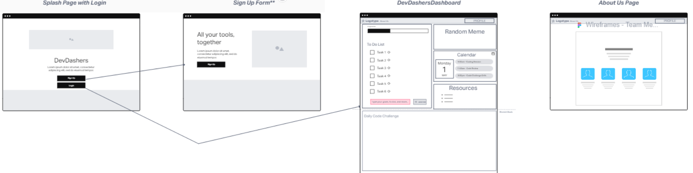
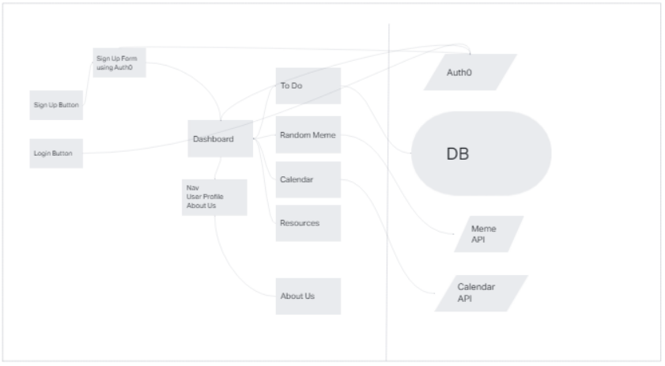
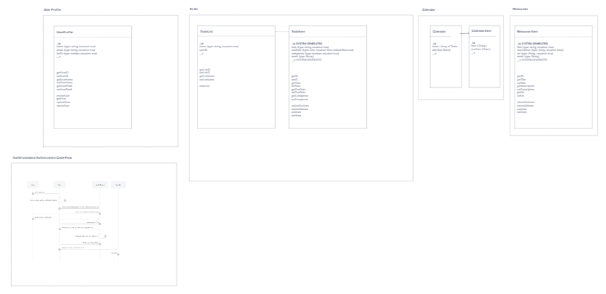

# DevDashers Dashboard - Back End

 DevDashers Dashboard - Backend is a web application using JavaScript. Create, Update, and Delete To-Do Lists, Generate Random Meme images, gives users a random code challenge each day. This Repo will be the backend of an application, creating calls to various APIs and MongoDB Cloud.

**Version**:

1.1.0 - Full CRUD functionality for ToDo List & Resources and Auth0 functionality  
1.0.0 - Repo Setup and Front end Connected to Backend API

## Getting Started

In order to get this code working you need to fill in the `.env` file after cloning the whole repo. You also would need a link to a MongoDB database.

## Architecture

This application uses `React`, `Axios`, `Cors`, `Dotenv`, `Express`, `JsonWebToken`, `jwks`, and `Mongoose`.

## Change Log

5-3-2023 ~ Complete Auth0 setup & removal of CRUD for Upcoming Tasks (unneeded!)  
5-2-2023 ~ Complete CRUD for ToDo & Resources & Memes - Start working on CRUD for Upcoming Tasks  
5-1-2023 ~ Start of CRUD for ToDo & Resources & Memes  
4-29-2023 Create Repo  

## Credit and Collaborations

- [Michael "Ike" Steoger](https://github.com/IkeSteoger)  
- [Heather Holcomb](https://github.com/holcombheather)  
- [Kaeden O'Meara](https://github.com/KaedenOC)  
- [Donna Ada](https://github.com/donnaada)

## [Front End Repo](https://github.com/DevDashers/dashboard-frontend)

## WireFrame

## Domain Modeling

## Data Schema

